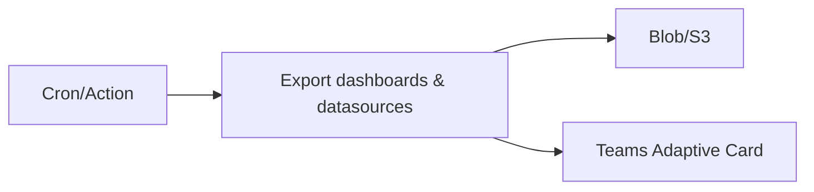

# Grafana Backup & Monitoring
Automated backups with restore workflow and Teams notification.

## Flow


## Restore
```bash
grafana-backup restore --from ./artifacts/latest.tgz --url $GRAFANA_URL --token $TOKEN
```

## Outcome
- Backups verified; restore < 2 min for typical set
